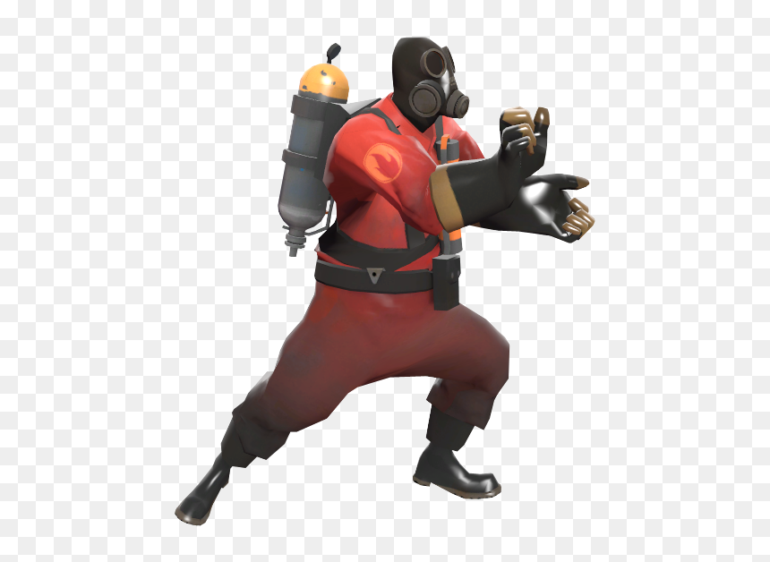
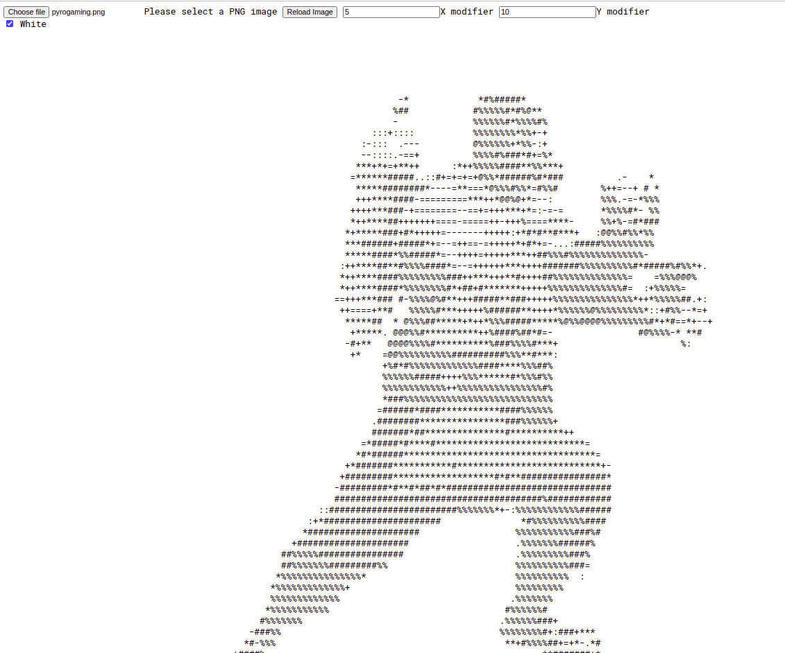

# This is a working enviroment for wasm and Webpack dev

Recomended x: 5 and y: 10, PNG will probably work, some still broken.

Commit b81430d is currently hosted on https://rukarangi.github.io./

## Wasm

To compile rust to wasm run in "image-to-ascii-rukarangi/":
`
wasm-pack build
`
This will compile into "pkg/" where it can be used in "www/"

## Webpack

To run the dev server:
`
npm start
`
Will compile and run a dev server.

## Note:

Will require:
* node
* rustc/cargo/etc.
* wasm-pack

### Examples

#### Original

#### Ascii

